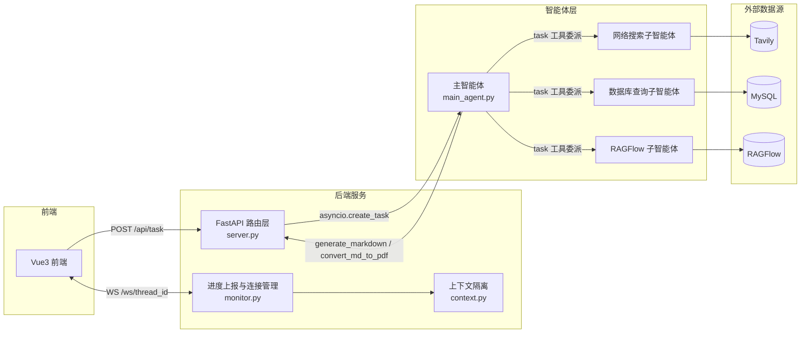

# DeepSearch · 多智能体深度检索与文档生成系统

基于 **FastAPI + deepagents** 的多智能体应用。系统由一个主智能体统一编排 **网络搜索、数据库查询、RAGFlow 知识库** 三个专业子智能体，结合 Markdown / PDF 文件生成能力，实现「检索 → 分析 → 生成文档」的一站式服务。

---

## 目录

- [功能特性](#功能特性)
- [系统架构](#系统架构)
- [核心设计](#核心设计)
- [技术栈](#技术栈)
- [项目结构](#项目结构)
- [快速开始](#快速开始)
- [使用指南](#使用指南)
- [API 接口](#api-接口)
- [部署说明](#部署说明)
- [常见问题](#常见问题)

---

## 功能特性

- **多智能体编排**：主智能体（supervisor）协调三个专家子智能体并行/串行完成复杂任务
  - 🔍 **网络搜索助手**：基于 Tavily 检索互联网公开信息
  - 🗄️ **数据库查询助手**：直接对接 MySQL，查询示例商品 / 库存 / 销售数据
  - 📚 **RAGFlow 助手**：对接 RAGFlow 知识库，检索私有知识库内容
- **文件生成**：Markdown 生成、Markdown→PDF 转换、上传文件内容解析（Word / Excel / PDF / MD / TXT）
- **实时进度推送**：WebSocket 定向推送工具调用、子智能体委派、最终结果等运行状态
- **会话隔离**：每个任务独立工作目录 `output/session_{id}`，基于 `ContextVar` 的协程级上下文隔离，支持多用户并发互不干扰
- **文件管理**：上传文件自动迁移到工作目录，生成文档可在线预览与下载
- **安全防护**：文件路径穿越校验、上传文件名清洗、密钥环境变量化管理

---

## 系统架构

### 架构图



### 请求数据流

1. 前端生成持久 `thread_id`，通过 `POST /api/task` 提交自然语言任务。
2. 后端 `run_task` 立即返回 `thread_id`，并用 `asyncio.create_task` 在后台异步执行 `run_deep_agent`，不阻塞 HTTP 响应。
3. 主智能体根据 system prompt 规划任务，通过 deepagents 内置的 `task` 工具委派子智能体。
4. 子智能体调用各自工具（Tavily 搜索 / MySQL 查询 / RAGFlow 提问）获取信息，结果返回主智能体。
5. 主智能体汇总信息后，调用 `generate_markdown` / `convert_md_to_pdf` 生成文档。
6. 全程通过 `monitor` 单例收集事件，经 WebSocket 按 `thread_id` 定向推送到前端。

---

## 核心设计

### 1. 多智能体编排（supervisor 模式）

主智能体持有 `model`、文件生成工具和三个子智能体，负责**理解意图、拆解任务、委派子智能体、汇总结果**；子智能体是独立的配置字典，各含 `name / description / tools / system_prompt`。

- **上下文隔离**：子智能体只拿到主智能体传来的 `description` 任务描述，看不到主智能体的完整历史，各自返回结果，避免上下文无限膨胀。
- **能力隔离**：数据库子智能体的专属 prompt 规定了「先 `list_sql_tables` → 再 `get_table_data` → 最后 `execute_sql_query`」的工作流，与搜索/文档生成任务互不干扰。

### 2. 会话隔离与并发安全

FastAPI 的 asyncio 单线程模型下，普通全局变量会在多个请求间串数据，`threading.local` 也因协程同线程而失效。系统用 `ContextVar` 实现**协程级（task 级）**隔离：

- `_session_dir_ctx`：当前请求的会话工作目录
- `_thread_id_ctx`：当前请求的会话 ID

每个 `asyncio.create_task` 创建的任务拥有独立上下文，工具在任意深处调用 `get_session_context()` 即可拿到属于自己的目录，无需层层传参。任务结束在 `finally` 中 `reset` 防止上下文泄漏。

### 3. 实时进度推送与跨线程投递

工具执行时通过 `monitor` 单例上报事件，`ConnectionManager` 按 `thread_id` 维护 WebSocket 连接并定向推送。关键难点在于：agent 可能在后台线程执行，而 WebSocket 发送必须在它所属的事件循环里。`_emit` 中通过判断 `current_loop == manager_loop` 来选择：

- 同循环 → `loop.create_task(...)`（高效）
- 跨线程 → `asyncio.run_coroutine_threadsafe(...)`（线程安全投递）

事件循环在服务启动时（`startup_event`）绑定到 `ConnectionManager`。

### 4. 路径安全与 LLM 输出防御

LLM 输出本质上是不可信输入，系统用「prompt 软约束 + 代码硬约束」双重防御：

- **软约束**：system prompt 强制「只能在工作目录下创建/读取/保存文件」「禁止使用绝对路径」。
- **硬约束**：`resolve_path` 清洗模型幻觉出的虚拟路径前缀（`/workspace`、`/mnt/data`、`/home/user`），识别 `upload/` 强制重定向，修正 `session_x/session_x` 重复嵌套。
- **越界校验**：下载/列表接口用 `Path.resolve()` + `is_relative_to()` 双重校验，防止路径穿越。

### 5. 文档生成链路

PDF 生成采用 **Markdown → HTML → Word COM → PDF** 方案：`markdown` 库把 Markdown 转成带样式的 HTML，再通过 `win32com.client` 调用本机 Microsoft Word 打开 HTML 并 `SaveAs`（`FileFormat=17` 即 PDF）。选择 Word COM 是为了获得成熟的中文排版与复杂表格支持。

---

## 技术栈

| 层面 | 技术 |
|------|------|
| 后端框架 | FastAPI + Uvicorn |
| 智能体框架 | deepagents + LangChain |
| LLM | 通义千问 Qwen（OpenAI 兼容接口） |
| 向量知识库 | RAGFlow SDK |
| 网络搜索 | Tavily |
| 数据库 | MySQL（mysql-connector-python） |
| 前端 | Vue 3 + TypeScript + Vite |
| 文档处理 | python-docx / pypdf / pandas / markdown |
| PDF 转换 | pywin32（调用 Microsoft Word COM） |
| 日志 | colorlog |

---

## 项目结构

```
DeepSearch/
├── main.py                    # 服务启动入口
├── api/
│   ├── server.py              # FastAPI 路由层（任务/上传/文件/WebSocket）
│   ├── monitor.py             # 进度上报与 WebSocket 连接管理
│   └── context.py             # 上下文变量（会话目录、线程 ID 隔离）
├── agent/
│   ├── main_agent.py          # 主智能体编排与流式执行
│   ├── llm.py                 # LLM 模型初始化
│   ├── load_prompt.py         # Prompt 配置加载
│   └── sub_agents/            # 三个子智能体
│       ├── internet_sub_agent.py
│       ├── db_sub_agent.py
│       └── rag_sub_agent.py
├── tools/                     # Agent 可用工具
│   ├── internet_search_tool.py  # 网络搜索
│   ├── mysql_tools.py           # 数据库查询
│   ├── ragflow_tools.py         # RAGFlow 提问
│   ├── markdown_tools.py        # Markdown 生成
│   ├── pdf_tools.py             # MD → PDF
│   └── upload_file_read_tool.py # 上传文件解析
├── prompt/prompts.yaml        # 主/子智能体 Prompt 配置
├── utils/                     # 日志、路径解析、文档转换工具
├── sql/company_data.sql       # 示例数据库初始化脚本
├── ui/                        # 前端（Vue 3 + Vite）
├── output/                    # 会话生成文档（运行时自动创建）
└── upload/                    # 用户上传文件（运行时自动创建）
```

---

## 快速开始

### 环境要求

| 依赖 | 版本要求 | 说明 |
|------|---------|------|
| Python | >= 3.12 | 推荐使用 uv 管理依赖 |
| MySQL | 任意 8.x | 需本地可连接，用于示例数据库 |
| Node.js | 18+ | 用于前端构建与开发 |
| Microsoft Word | 任意较新版本 | **仅 PDF 生成功能需要**（Windows 平台） |

> ⚠️ PDF 生成通过 Word COM 接口实现，因此该功能**仅支持 Windows 且本机需安装 Microsoft Word**。Markdown 生成、文件解析、检索问答等功能不受此限制。

### 1. 安装依赖

```bash
# 后端依赖（项目根目录）
uv sync
```

```bash
# 前端依赖
cd ui
npm install
```

### 2. 配置环境变量

```bash
cp .env_example .env
```

编辑 `.env` 填入实际配置：

```ini
# RAGFlow 配置（可选，不使用 RAGFlow 功能可留空）
RAGFLOW_API_URL=http://your-ragflow-host
RAGFLOW_API_KEY=your-key

# LLM 配置（通义千问 OpenAI 兼容接口，必填）
DASHSCOPE_BASE_URL=https://dashscope.aliyuncs.com/compatible-mode/v1
DASHSCOPE_API_KEY=your-key
LLM_QWEN_PLUS=qwen-plus

# Tavily 搜索（可选）
TAVILY_API_KEY=your-key

# MySQL 配置（必填）
MYSQL_USER=root
MYSQL_PASSWORD=your-password
MYSQL_DATABASE=pharma_db
MYSQL_HOST=localhost
MYSQL_PORT=3306
```

### 3. 初始化数据库（可选）

导入 `sql/company_data.sql` 创建示例数据库（含药品、库存、销售三张表及模拟数据）：

```bash
mysql -u root -p < sql/company_data.sql
```

> 不导入示例数据也可启动服务，但数据库查询子智能体将无数据可查。

### 4. 启动后端

```bash
python main.py
# 或
uv run python main.py
```

启动成功后：

- 后端 API：`http://localhost:8000`
- 接口文档（Swagger）：`http://localhost:8000/docs`
- 健康检查：`http://localhost:8000/api/health` → `{"status":"ok"}`

### 5. 启动前端

```bash
cd ui
npm run dev
```

前端默认运行在 `http://localhost:5173`，通过跨域直连后端 `http://localhost:8000`（后端已配置 CORS 允许所有来源）。

### 6. 验证

1. 打开 `http://localhost:8000/docs`，确认 Swagger 正常加载。
2. 打开前端 `http://localhost:5173`，输入「查询数据库中的药品信息，生成一个 Markdown 文件」。
3. 观察前端实时显示工具调用、子智能体委派过程，最终在侧边栏看到生成的文档。

---

## 使用指南

### 完整交互流程

1. 前端页面加载时生成持久 `thread_id`（`crypto.randomUUID()`，刷新前不变），并建立 WebSocket 连接 `ws://localhost:8000/ws/{thread_id}`。
2. 用户在输入框输入任务（可附带多个上传文件）。
3. 若有文件，前端先 `POST /api/upload` 上传到 `upload/session_{thread_id}`。
4. 前端 `POST /api/task` 提交任务，后端立即返回 `thread_id` 并后台执行。
5. 任务执行过程中，后端通过 WebSocket 推送事件，前端实时展示"思考过程"。
6. 任务完成后，前端通过 `GET /api/files` 列出生成文件，通过 `GET /api/download` 下载。

### 使用示例

| 场景 | 输入示例 | 预期结果 |
|------|---------|---------|
| 数据库查询 + 文档生成 | 「查询数据库中的药品信息，生成一个 pdf 文件」 | 生成 Markdown 后转换为 PDF |
| 数据库聚合分析 | 「统计每个治疗领域的药品数量，生成 Markdown」 | 调用 `execute_sql_query` 聚合查询 |
| 公开信息检索 | 「搜索最新的行业政策并整理成 Markdown」 | 网络搜索子智能体检索并生成文档 |
| 私有知识库问答 | 「向 RAGFlow 助手询问知识库中的相关内容」 | RAGFlow 子智能体提问 |
| 文件解析 | 上传 Excel 后问「分析这个表格的数据」 | `read_file_content` 解析并附统计信息 |

### WebSocket 事件类型

任务执行过程中服务端通过 WebSocket 推送以下事件（`event` 字段）：

| 事件 | 含义 | data 字段示例 |
|------|------|--------------|
| `session_created` | 会话工作目录已创建 | `{"path": "D:/.../output/session_xxx"}` |
| `tool_start` | 工具开始执行 | `{"tool_name": "Markdown文档生成工具", "args": {...}}` |
| `assistant_call` | 正在委派子智能体 | `{"assistant_name": "数据库查询助手", "args": {...}}` |
| `task_result` | 任务执行完成 | `{"result": "最终回复文本"}` |
| `error` | 执行出错 | `{"error": "错误信息"}` |

---

## API 接口

| 方法 | 路径 | 说明 |
|------|------|------|
| GET | `/api/health` | 健康检查 |
| POST | `/api/task` | 提交任务，后台异步执行 Agent，返回 `thread_id` |
| POST | `/api/upload` | 上传文件到 `upload/session_{thread_id}` |
| GET | `/api/files` | 列出指定会话目录下的生成文件 |
| GET | `/api/download` | 下载会话生成文件（仅限 output 目录内） |
| WS | `/ws/{thread_id}` | WebSocket 实时进度推送 |

### 示例

**提交任务**：

```bash
curl -X POST http://localhost:8000/api/task \
  -H "Content-Type: application/json" \
  -d '{"query": "查询数据库中的药品信息，生成一个 Markdown 文件"}'
```

响应：

```json
{"status": "started", "thread_id": "26c36d39-d965-4b65-b8f6-01b7a50f0db9"}
```

**列出生成文件**：

```bash
curl "http://localhost:8000/api/files?path=D:/项目路径/output/session_xxx"
```

---

## 部署说明

### 开发环境部署

按上文「快速开始」即可完成本地开发部署（后端 + 前端 + MySQL）。

### 生产环境注意事项

本项目当前定位为个人项目/演示，若需部署到生产环境，建议补充以下能力：

- **认证授权**：当前接口无鉴权，需增加用户系统。
- **限流与并发控制**：`/api/task` 无任务队列和并发上限，需引入任务队列（Celery/ARQ）或信号量限流。
- **PDF 方案跨平台化**：Word COM 依赖 Windows，可替换为 LibreOffice headless 或容器化服务。
- **CORS 收敛**：将 `allow_origins=["*"]` 收敛为具体前端域名白名单。
- **数据库安全**：为 agent 使用只读数据库账号，并限制 SQL 为只读查询。

---

## 常见问题

**Q：启动时日志出现 `ModuleNotFoundError: langchain_aws / langchain_fireworks`？**

A：这是 deepagents 尝试加载可选中间件（Bedrock / Fireworks 的 prompt caching）的无害提示，不影响任何功能，可忽略。

**Q：PDF 生成失败或报错？**

A：PDF 生成依赖 Windows 本机安装的 Microsoft Word。确认已安装 Word，且服务在 Windows 环境下运行。

**Q：数据库查询返回"数据库连接失败"？**

A：检查 `.env` 中 MySQL 配置是否正确，MySQL 服务是否启动，`pharma_db` 数据库是否已通过 `sql/company_data.sql` 初始化。

**Q：前端无法连接后端？**

A：确认后端 `python main.py` 已在 `http://localhost:8000` 启动，且前端通过 `npm run dev` 运行。前端硬编码连接 `localhost:8000`，如需修改请在 `ui/src/App.vue` 中调整。

---

## 说明

- `.env` 存放敏感配置，已被 `.gitignore` 排除，仓库为example模板，应自己根据模板生成一份`.env`。
- RAGFlow SDK 请固定使用 `0.24.0` 版本（`pyproject.toml` 中已锁定），高版本存在兼容性问题。
- `output/`、`upload/` 为运行时生成目录，已被 `.gitignore` 排除。
